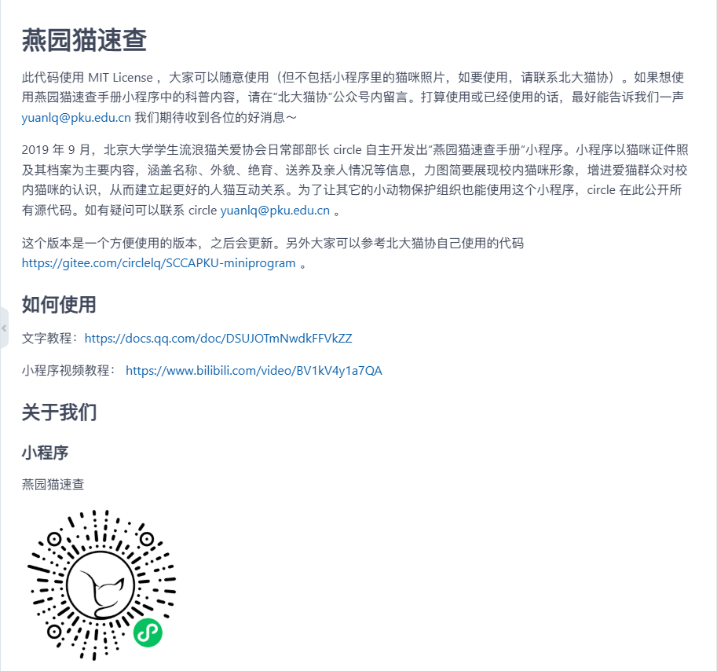
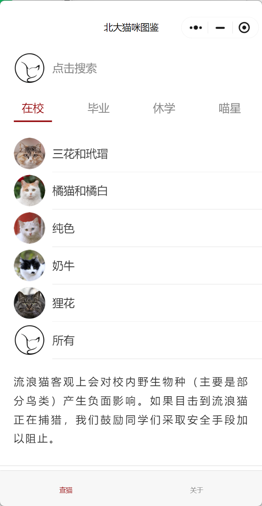
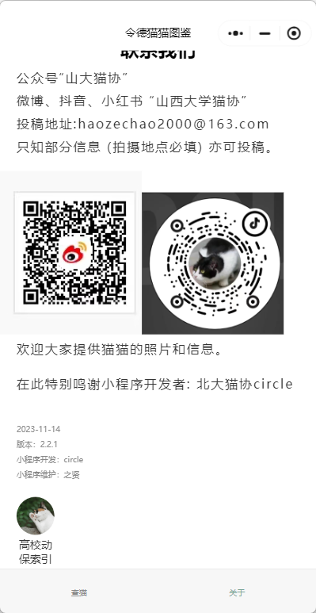
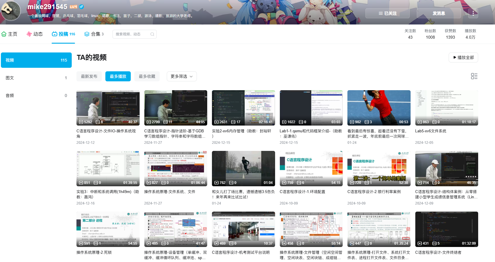
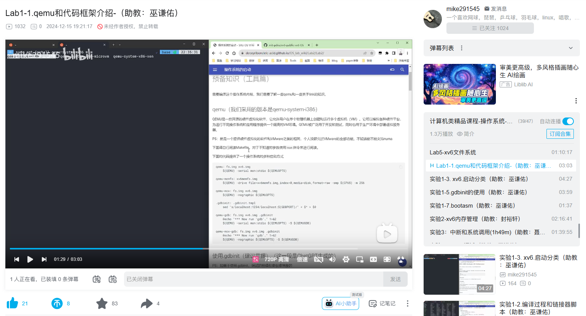
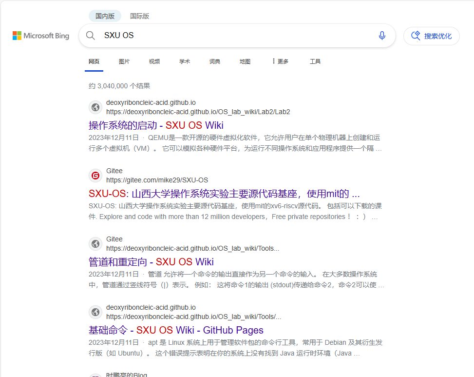

# 一叶知秋

作为一种技术，计算机最重要的是解决实际问题。我们先来看一个开源项目[北大猫协小程序](https://github.com/SCCAPKU/miniprogram)

如图，这位北大的开发者开发了一套帮助同学识别校园内猫咪的小程序，作者还附有很详细的部署说明，我校猫协也使用了这套代码，开发了小程序令德猫猫图鉴：

这样的例子在实际开发中随处可见,体现出开源精神的核心-代码复用，通过复用代码，其它开发者可以不重复造轮子. 专注于解决其它问题。对学计算机的同学来说，很重要的一个能力就是分析并解决实际问题，训练这种能力的最好方法就是参与到实际开发过程中，开源氛围浓厚的社区无疑是一个开发者成长的最好土壤，搭建并维护一个镜像站能起好的开头作用，后续我们希望的是和更多同学一起解决实际问题，锻炼自己解决问题的能力，为此有一台或者多台由学生自主管理的服务器是非常有帮助的，我们可以在服务器上部署同学们需要的服务，在实践中学习。

# 见微知著

作为一门科学，计算机的学习应该是充满趣味的。我校陈千老师的授课方式独树一帜，我们认为这样的课程是十分有益的：

* 陈千老师有自己的B站账号，上面有他讲解的C语言课程和操作系统的视频

* 陈千老师的课程讲义有gitee仓库，所有内容可自由访问[gitee](https://gitee.com/mike29)
* 陈千老师在教授c语言是不仅局限在c语言本身，还包括开发环境的搭建，使用gdb调试，vim，在linux系统上编译并运行程序等等，这些都是实际开发中非常重要的技能，而且这些内容在c语言课程引入是非常合适的，因为c语言是一个非常底层的语言，也是大部分新生的第一门编程语言，课程的内容不应该只囊括语法，如果学生通过这这门课程只能学到在IDE里编写简单程序那是远远不够的，陈千老师通过对编译器的介绍，引入linux操作系统，让学生在linux系统上编辑、编译、调试程序，可以让人更深刻地理解程序是如何运行的。
* 陈千老师会请一些优秀同学担任助教，引入一些开源项目做Lab，比如qemu，我校也有了帮助同学们学习操作系统地wiki：[SXUOS](https://deoxyriboncleic-acid.github.io/OS_lab_wiki/Lab2/Lab2/)

北大有一门计算机基础的课程，实验引用自csapp的dataLab，内容大概包括从程序的位级运算到实现一个shell，尽管难度极高，每年担任这门课程的助教都会变更一些内容，让实验难上加难。这是一个趋势，用心授课的老师会寻找更有价值的内容帮助学生理解知识，运用到实际之中。

值得一提的是，计算机领域有非常多的优质的开源课程，[csdiy](https://csdiy.wiki/)汇集了广受好评的众多课程，国内也有中科大举办的[一生一芯计划](https://ysyx.oscc.cc/docs/)，可以说计算机学生的学习资源一点都不比MIT/standford的学生少，我们希望能和更多的同学一起学习，做Lab，帮助老师引入开源项目，帮助同学们做更有价值的实验。
