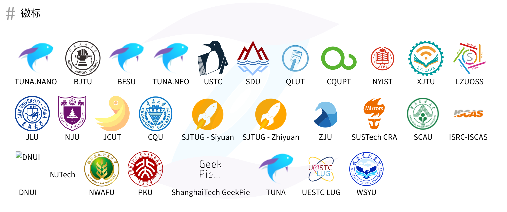
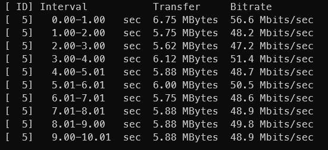

# SXU-Mirror

本项目搜集整理搭建开源镜像站的相关信息，意在完成一份切实可行的项目策划书以向校方申请服务器等相关资源。

## 项目背景

> 《中华人民共和国国民经济和社会发展第十四个五年规划和2035年远景目标纲要》,明确提出支持数字技术开源社区等创新联合体发展;国务院印发《“十四五”数字经济发展规划》,提出支持具有自主核心技术的开源社区、开源平台、开源项目发展,推动创新资源共建共享,促进创新模式开放化演进;工业和信息化部印发《“十四五”软件和信息技术服务业发展规划》,系统布局“十四五”开源生态发展。                	  																						                                                           --[中视时讯](https://www.thepaper.cn/user_5371878)

计算机行业的发展总是伴随着开源文化，从底层的 GNU 工具链到 PyTorch 等深度学习框架，开源项目已成为技术生态的核心支柱；全球开发者通过 GitHub 等平台协作创新，形成了开放共享的技术生态。在教育领域，开源文化的影响也随处可见，国内诸多高校都有开源社团，比较知名的有北京大学的 LCPU 俱乐部，清华大学的 tnua 等等，这些社团不仅教会学生们很多开发技能，还和一些开源组织合作，共同开发一些项目。许多开源社团都部署了开源镜像站，为师生和许多开发者提供了高效资源支持，详情可参考[校园网联合镜像站](https://mirrors.cernet.edu.cn/)。

## 什么是镜像站

镜像站（Mirror Site）是指对主站点（源站）内容进行完整复制的分布式服务器节点，其核心目标是通过**就近访问、负载均衡、容灾备份**提升用户体验和系统稳定性。常见于开源软件仓库（如 Debian、Apache）、学术资源平台（如 arXiv）、全球性网站（如 Wikipedia）等场景。

据调查，我校校园网存在部分同学下载速度不满足需求，部分非计算机专业同学找不到需求软件的镜像资源等问题。

## 搭建镜像站的价值

* 为师生提供更快速的下载服务，提高开发效率。
  未办理校园卡的同学想下载大型软件耗费的流量非常大，非计算机专业同学可能会下载不可信资源到学校的服务器，而一个处于学校内网的镜像站可以完美解决这些问题。
* 提升学校知名度
  如果学校允许给与公网 IP，mirrors.sxu.edu.cn，那么镜像站可以为全国开发者提供服务，这也是学校计算机学科强大的体现
* 为学校的开源社团提供更好的资源支持，让学生在实践中学习
  关于此项，可详见[开源文化中学习](./Opensource_study/DONTREADME.md)

## 如何搭建镜像站

搭建镜像站涉及很多方面，我们的基础目的是：搭建一个在限定预算内有较高性能并能提供相对完备服务的镜像站，同步常用软件，预留一定空间供其他同学申请特定镜像资源。

### 硬件层面

#### Plan A

向学校申请服务器、硬盘等资源，满足服务的基本配置要求。

需求大概为：

* 学校闲置服务器、替换的磁盘等等
* 预算
  我们需要调查其他学校搭建镜像站的硬件配置，大概估算价格，供学校参考，该内容放在 `planA` 目录下

#### Plan B

社团大概还有6000团费，在这个预算内尽可能搭建起一个功能完备的镜像站，该项可供同学们自由发挥，最终选定一个最优解，被选中的贡献者获得 $(6000 - 你的方案的预算) * 0.05$ 的奖金，满足镜像站服务的参考配置可以参考 [Mirroring Howto · tuna/tunasync Wiki · GitHub](https://github.com/tuna/tunasync/wiki/Mirroring-Howto)，你给出方案的内容放在jumping/planB目录下

PlanA 和 PlanB 同步进行，给学院看也需要一些方案，不过更重要的应该是让学院相信我们有把事情办成的能力。

### 软件层面

该项主要包括操作系统的选取，需要镜像何种软件，如何同步，组磁盘阵列等等。这个部分主要涉及运维的知识，因为都是学生运维，没啥经验，肯定会碰到不少问题，只能不断折腾，内容有待完善。各位可以修正以下不严谨或不详细的内容，在 `software` 目录中提出自己的方案。

#### 操作系统

包括 Windows Server 在内的任何稳定的操作系统，都可以作为镜像站的操作系统，（用 Windows Server 多少感觉有点抽象，没一家镜像站这么干的），Linux 比较主流的发行版像 Rocky、Debian 系列等等都是可选项，对于操作系统，最大的要求是稳定、安全、易于维护。

#### 文件系统

 比较出名的文件系统有 ext4、Btrfs 和 ZFS，这部分的资料可以参考[文件系统 - Arch Linux 中文维基](https://wiki.archlinuxcn.org/wiki/%E6%96%87%E4%BB%B6%E7%B3%BB%E7%BB%9F)，[分区与文件系统 - Linux 201](https://201.ustclug.org/ops/storage/filesystem/#filesystem)，值得一提的是中科大和清华镜像都使用 ZFS 文件系统，其集成了一系列存储管理功能，而且安全性十分有保障，[ZFS - Linux 201](https://201.ustclug.org/ops/storage/zfs/#concepts)中也提到了不少妙妙参数，可以极大提高文件系统的性能。

#### 磁盘

磁盘本身应该属于硬件方面，购买硬盘需要考虑大小，接口协议等等。这里还涉及组磁盘阵列（RAID），目的是提高存储的性能和可靠性，目前常见的方案有两种，一种是硬件组 RAID，一般服务器厂商会提供自己的硬件 RAID 方案，比如 MegaRAID，按下指定按键进入 RAID 卡设置界面操作，另一种是软件 RAID，其核心是 Linux 内核的 md 模块，常见的软件有 madadm，此外，还可以通过 LVM(Logical Volume Manager) 来组 RAID，不过一般不推荐这么做，ZFS 使用存储池的概念来管理物理存储，可参考[https://wiki.archlinux.org/title/ZFS#Creating_ZFS_pools](https://wiki.archlinux.org/title/ZFS#Creating_ZFS_pools)。

关于 RAID 级别和介绍可参考维基百科和[Linux Raid 维基 --- Linux Raid Wiki](https://archive.kernel.org/oldwiki/raid.wiki.kernel.org/)。

#### 镜像

如果要对某个镜像站经行大量初始化同步最好还是先给对方发邮件，中科大镜像明确提出了这一点[科大源同步方法与注意事项 - USTC Mirror Help](https://mirrors.ustc.edu.cn/help/rsync-guide.html)。

镜像同步的软件通常使用rsync，一些镜像站做了自己的镜像管理工具，比如tuna的[https://github.com/tuna/tunasync](https://github.com/tuna/tunasync),中科大的[https://github.com/ustclug/yuki?tab=readme-ov-file#quickstart](https://github.com/ustclug/yuki?tab=readme-ov-file#quickstart) 和[https://git.lug.ustc.edu.cn/mirrors/mirrors-index](https://git.lug.ustc.edu.cn/mirrors/mirrors-index)

这里列一些大家想同步的镜像：

| 镜像名称    | 地址                                                                          | 容量参考 |
| ----------- | ----------------------------------------------------------------------------- | -------- |
| blackarch   | [www.blackarch.org/blackarch](www.blackarch.org/blackarch)                       | 95.28G   |
| archlinux   | [http://mirror.rackspace.com/archlinux/](http://mirror.rackspace.com/archlinux/) | 108.75G  |
| archlinuxcn | [Arch Linux 中文社区 软件仓库 [archlinuxcn]](https://repo.archlinuxcn.org/)      | 111G     |

此外，还可以同步一些 Github 的常用软件。

### 关于网络

使用 iperf3 内网测速如图：

服务器是可以接入万兆网的，要么托管系楼机房，要么托管现代教育技术学院。

关于镜像站域名，可以在 **企业微信>工作台>网络服务资源申请>校内建站** 申请。

理论上来说，如果只是满足学校内网使用的话，Python 起个 http-server 就足够了，不过最好还是用 nginx 这种 Web 服务器来托管。

### 其它

前端可以参考清华中科大和其他镜像站的仓库；

基本上搭建镜像站没啥技术上的难点，都有现成的开源项目可以直接用，剩下一点画饼和拉投资的问题。

## 饼和未来

说实话搭建镜像站的实际价值价值并没有多高，毕竟已经有不少高校同步各种资源了，有特定需求的开发者也有自己的手段解决，不过这是一个不错的开端，能向学校申请到服务器，没准还能拿到多个服务器组个集群啥的，会方便很多，还可以和其它社团合作，毕竟开源软件社团应该能利用开源软件解决不少实际问题。有一个需要不断维护的镜像站也是好事，一方面可以锻炼运维能力，维持社团生命力，这段经历也可以写在简历上的“项目经历”里，另一方面后续可能会请开源组织来讲座，这个项目能增加对方理会我的概率。

后续社团会借此机会联系一下以前的社员，可能会办一些技术沙龙，营造开源社区的氛围。

## 流程一览

* [ ] 写申请书，看看学院态度，能给什么资源
* [ ] 根据现有资源购置服务器，磁盘等等，确定要同步的镜像
* [ ] 项目大成功，服务正式上线/因为各种失败，删库跑路
